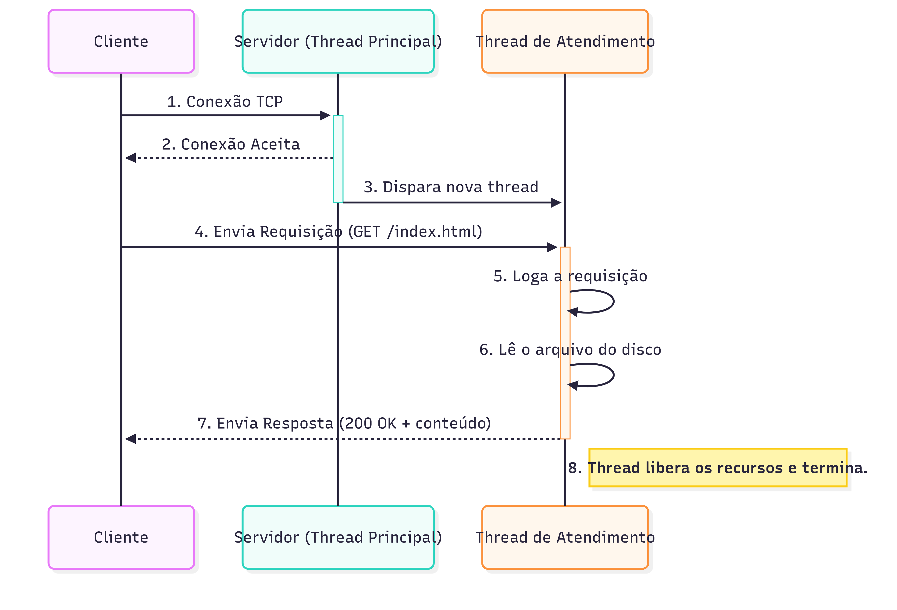

# Relatório Técnico Final - Mini Servidor Web

## 1. Diagrama de Sequência Cliente-Servidor

O diagrama a seguir foi gerado com uma ferramenta gráfica externa para ilustrar o fluxo de uma requisição GET bem-sucedida.

## 2. Mapeamento Requisitos -> Código

Esta seção mapeia cada requisito do projeto para sua implementação no código-fonte.

| Requisito Geral | Implementação | Arquivo(s) |
|---|---|---|
| **1. Threads** | Uso de `pthread_create` para cada conexão. | `app/servidor.c` (função `start_server`) |
| **2. Exclusão Mútua** | `pthread_mutex_t` para proteger o arquivo de log e o contador de estatísticas. | `lib/tslog.c`, `app/servidor.c` |
| **3. Semáforos/Condvars** | A fila de conexões é gerenciada pelo kernel via `listen()`, não sendo necessário semáforo customizado. | `app/servidor.c` |
| **4. Monitores** | A `struct ts_logger_t` e suas funções (`tslog_*`) encapsulam dados e sincronização. | `lib/tslog.h`, `lib/tslog.c` |
| **5. Sockets** | Uso da API de Sockets POSIX (`socket`, `bind`, `listen`, `accept`). | `app/servidor.c` |
| **6. Gerenciamento de Recursos** | `free()`, `fclose()`, `close()`, `tslog_destroy()`, `pthread_mutex_destroy()`. `pthread_detach` para liberar threads. | Todos |
| **7. Tratamento de Erros** | Verificação de retornos de chamadas de sistema e uso do logger para registrar erros. | Todos |
| **8. Logging Concorrente** | Uso intensivo da `libtslog` criada na Etapa 1. | `app/servidor.c` |
| **10. Build** | `Makefile` robusto com alvos para servidor, teste e limpeza. | `Makefile` |

| Requisito Específico (Tema B) | Implementação | Arquivo(s) |
|---|---|---|
| **Servidor Concorrente** | Modelo "thread por conexão". | `app/servidor.c` (`start_server`, `handle_connection`) |
| **Atender GET** | Parser básico de HTTP e leitura de arquivos do disco. | `app/servidor.c` (`handle_connection`) |
| **Logging Integrado** | Chamadas a `tslog_log` em pontos chave (requisição, erro, status). | `app/servidor.c` |
| **Fila de Conexões** | Parâmetro `MAX_CONEXOES_PENDENTES` na função `listen()`. | `app/servidor.c` |
| **CLI Completa** | Argumentos `start`, `stop`, `status` com daemonização e gerenciamento de PID. | `app/servidor.c` (`main`, `daemonize`) |

## 3. Relatório de Análise com IA (LLM)

**Prompt Inicial:** "Preciso criar um mini servidor web em C para um projeto da faculdade. Os requisitos são X, Y, Z. Pode me ajudar a traçar um plano de ação e fornecer o código inicial para um servidor TCP básico?"

**Resumo das Sugestões da IA:**
O LLM (Gemini) foi fundamental para estruturar o projeto em etapas lógicas e incrementais (Etapa 1: Log, Etapa 2: Protótipo, Etapa 3: CLI). Ele forneceu "boilerplate" (código base) para sockets e pthreads, o que acelerou o desenvolvimento inicial. As explicações sobre conceitos como `Makefile`, `VPATH`, `daemonize` e `signal handling` foram cruciais para entender não apenas "o quê" fazer, mas "por quê".

**Análise Crítica e Valor Agregado:**
A principal vantagem do uso do LLM foi a velocidade e a superação de bloqueios. Em vez de gastar horas pesquisando a sintaxe exata para `setsid()` ou como lidar com `SIGTERM`, eu pude obter um exemplo funcional em segundos e focar em entendê-lo e adaptá-lo. O LLM atuou como um "tutor sênior" disponível 24/7. No entanto, a IA cometeu pequenos erros (como esquecer um `#include` ou a complexidade de `make` com subdiretórios), o que exigiu depuração e um entendimento real do código. Isso reforça que a IA é uma ferramenta de produtividade, não um substituto para o conhecimento fundamental. O valor agregado foi imenso, transformando um projeto potencialmente frustrante em uma experiência de aprendizado guiada e eficiente.